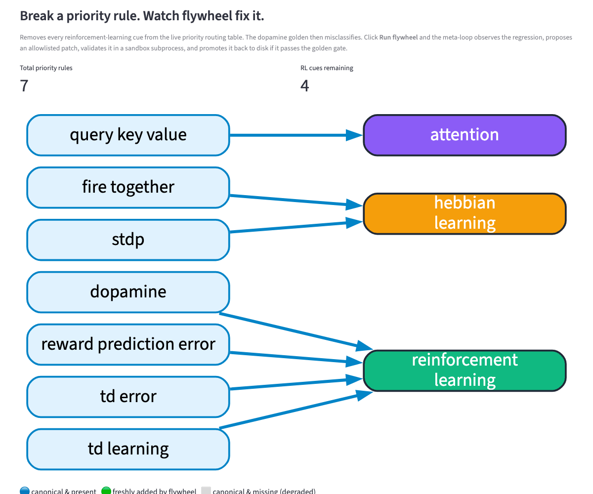

# Neuro-OS

> A self-evolving, self-modifying knowledge OS — closed-loop OEC over both knowledge and code, with allowlisted patches and sandboxed validation.

What if your knowledge system could observe its own mistakes, propose patches, sandbox-test them, and ship the ones that hold up — without you in the loop?

That is what `neuro-os` does. Two nested OEC loops (Observe → Evaluate → Control → Validate): one over **knowledge** (the neuroscience ontology), one over **code** (the priority-routing data the pipeline depends on). Both gates use the same golden-case oracle. Both record every mutation to a versioned, reversible registry.

---

## Quickstart (60 seconds)

The fastest path is the **UI** — see the system fix itself in front of you:



*The dopamine golden misclassifies. flywheel observes the regression, proposes a patch (`append_priority_rule`), validates it in a sandbox subprocess, and promotes it back to the live tree. The bright green edge is the freshly-promoted rule.*

```bash
git clone https://github.com/wjlgatech/neuro-os.git
cd neuro-os
pip install -e ".[ui]"
streamlit run ui/app.py
```

Or [deploy it free to Streamlit Cloud](ui/README.md#deploy-to-streamlit-cloud-free) (5 clicks).

Open http://localhost:8501. Four tabs:

| Tab | What it does |
|---|---|
| **🟢 Try It** | Paste a sentence; see TRUE scores + decision. |
| **🌱 Watch It Learn** | Feed a citation-rich contradiction; watch the ontology mutate. |
| **🔧 Self-Repair** | Break a priority rule, click Run flywheel, watch the loop fix it. |
| **📊 Readiness** | Score whether your own X is a fit for `flywheel-loop`. |

Or stay in the terminal:

```bash
python -m agent extract "Dopamine neurons encode reward prediction error signals."
python examples/03_self_repair.py      # watch the system fix itself
pytest                                 # 52 tests, ~0.7s
```

---

## What it does (architecture at a glance)

```
                 ┌──────────────────────────────────────────────────────────┐
                 │  L2  CODE LOOP  (self-modification)                       │
                 │  observe goldens → propose patch (allowlisted) →          │
                 │  sandbox apply → validate → promote-or-revert →           │
                 │  registry row + rollback patch                            │
                 └──────────────────────────────────────────────────────────┘
                                          ▲
                                          │  same golden-case oracle
                                          ▼
┌────────────────────────────────────────────────────────────────────────────┐
│  L1  KNOWLEDGE LOOP  (self-evolving ingestion)                              │
│  text → extract mechanism → consistency check → contradiction → refinement  │
│  proposal → TRUE + evidence eval → golden gate → ontology merge + persist   │
└────────────────────────────────────────────────────────────────────────────┘
                                          ▲
                                          │
                                          ▼
┌────────────────────────────────────────────────────────────────────────────┐
│  L0  PIPELINE                                                                │
│  raw text → run_pipeline → {knowledge, true_validation, decision}            │
│  offline keyword routing OR llm_fn (BYO LLM); priority-rules data file       │
│  is mutable by L2                                                            │
└────────────────────────────────────────────────────────────────────────────┘
```

L2 mutates the priority-rules data that L0 depends on. L1 mutates the ontology that L0 classifies into. Everything writes to `versions/version_registry.jsonl` with provenance.

---

## Belief OS — use it as a primitive, not a product

**Belief OS** (the `personal_epistemic_v1` domain) is a contradiction-aware reasoning ontology built on top of the L1 loop. It classifies a claim into one of six reasoning patterns (Bayesian updating, base-rate reasoning, falsifiability, expected value, second-order thinking, survivorship bias) and tracks how a user's beliefs change over time.

**Belief OS is not a standalone app.** The Streamlit tab is a reference implementation and QA harness; the load-bearing surface is a small, typed Python API (`agent/belief_os.py`) designed for **other products in the wjlgatech ecosystem to consume**:

- **company-os Founder OS** — call `check_decision_text(intent)` before promoting an intent to PLAN.md. Pause the approval gate when the intent invokes a known reasoning failure mode (`survivorship_bias`, `falsifiability`).
- **money-os** — call `BeliefOS(ontology_path=user_priors_file).ingest(thesis)` when a user captures an investment thesis. The L1 loop detects contradictions with prior theses and surfaces them at capture time, before position sizing.
- **research-os** (hypothetical) — call `ingest(text, source_type="research_paper")` when a user pastes a key claim from a paper. Build a per-user belief graph that survives across sessions and surfaces cross-paper contradictions.

```python
# Stateless one-off (no persistence, no API key needed)
from agent.belief_os import classify_belief, check_decision_text

result = classify_belief("Steve Jobs dropped out and became a billionaire — that's the smart move.")
# → ClassificationResult(mechanism='survivorship_bias', decision='ACCEPT', method='offline-keyword', ...)

# Founder-OS approval-gate pattern
gate = check_decision_text("Drop out — Jobs and Gates dropped out and became billionaires.")
if gate.flag_for_review:
    # → True; gate.flag_reason names the failure mode
    raise ApprovalRequired(gate.flag_reason)

# Persistent per-user belief graph
from agent.belief_os import BeliefOS
belief_os = BeliefOS(ontology_path="users/alice/priors.json", use_llm=True)
ingested = belief_os.ingest(claim, source_type="investment_thesis")
if ingested.contradicts_prior:
    surface_contradiction_to_user(ingested.primitive_updated)
```

End-to-end multi-consumer demo:

```bash
python examples/07_belief_os_consumer.py
# Simulates a Founder-OS approval gate, a money-os thesis-capture flow,
# a research-os paper-ingest flow, and a stateless one-off lookup —
# all calling into the same primitive.
```

Files: `agent/belief_os.py` · `agent/personal_epistemic_domain.py` · `agent/llm_extractors.py` · `examples/07_belief_os_consumer.py` · `tests/test_belief_os_api.py`.

---

## Features

Each block expands. Each entry covers three lenses:

- **Benefit** — what changes for a real user, business, or research program.
- **Innovation** — the conceptual or technological move.
- **AI-native impl** — the engineering choice that makes it tractable in the era of cheap inference.

<details>
<summary><strong>1. Closed-loop self-modification</strong> — the system patches its own routing logic, sandbox-validated, with rollback baked in</summary>

### Benefit
- **Real life:** leave the system running on a stream of telemetry overnight; it identifies its own classification regressions and ships patches without you in the loop.
- **Business:** lower TCO for any classification system — the meta-loop maintains accuracy as the input distribution drifts.
- **Research:** a working strange-loop demo. The same OEC pattern that improves the knowledge layer also improves the code that runs the pipeline.

### Innovation
- The OEC controller (Observe / Evaluate / Control / Validate) was already in the codebase but open at the bottom — `propose_controls` returned natural-language descriptions of changes, with no actuator. This release closes the loop with **structured, allowlisted patches** that the system can author, apply in a sandbox, and promote.
- **Two safety gates on every patch:** an **op allowlist** (`ALLOWED_OPS` in `agent/patches.py`) refuses any verb not on a whitelist; a **path allowlist** (`mutable_paths` per domain) refuses any target file not on a list. These are AND, not OR.
- **One-step rollback:** every promoted mutation logs a `rollback_patch` (the inverse op) so any change is reversible from the registry alone.

### AI-native impl
- `Patch` is a small dataclass (`op` + `payload` + `target_path`), not a code snippet. There is no `eval`, no string interpolation into source files, no `subprocess.run(shell=True, ...)`. The LLM agent that authors a `Patch` can only emit ops that already exist in `ALLOWED_OPS`.
- Validation runs in a fresh Python subprocess against a `tempfile.mkdtemp` copy of `agent/` — so even if a patch did corrupt module-level state, the live process is unaffected until promotion.
- Try it: `python examples/03_self_repair.py` or `python -m agent self-modify --domain neuro_os_self_v1`.

### Files
- `agent/self_modification.py` — orchestrator
- `agent/patches.py` — allowed ops, apply, inverses
- `agent/sandbox_runner.py` — sandbox creation + subprocess validators
- `tests/test_self_modification.py` — 4 cases including allowlist refusal and rollback-on-regression

</details>

<details>
<summary><strong>2. Self-evolving knowledge loop with golden gate</strong> — ingest text, detect contradictions, validate refinements, persist learning</summary>

### Benefit
- **Real life:** ingest research papers about contested topics; the system tracks contradictions, proposes refinements with citation evidence, and merges them only when they don't break what you already knew. Re-runnable, versioned, reversible.
- **Business:** a research team's knowledge graph stays internally consistent without a curator running grooming sweeps.
- **Research:** the contradiction detection and refinement-proposal generation are reproducible primitives — you can build your own OEC experiments on top of them.

### Innovation
- **TRUE** (Experimentable / Usable / Repeatable / Transferable) is used as both the **extraction structure** AND the **acceptance criteria**. Most pipelines validate against either a schema or a metric — TRUE is both: a fielded knowledge representation that doubles as a quality scoring grid.
- **Golden-case gate before every merge.** Knowledge updates that would degrade classification on canonical inputs are rolled back, even if their TRUE scores look perfect.
- **Learn-back.** Accepted refinements mutate the ontology in place AND get persisted to disk, so subsequent extractions are anchored to the evolved definitions.

### AI-native impl
- Pipeline composition: `extract_mechanism` (heuristic or LLM) → `_build_knowledge` (TRUE-fielded synthesis from raw text) → `_true_validation` (lightweight per-dimension scoring) → `evolve_from_extraction` → `evaluate_update_dict`.
- LLM-friendly: `extract_mechanism` accepts an `llm_fn` callable so you can plug in any provider (Anthropic SDK, OpenAI SDK, local vLLM). The default offline path uses keyword + priority routing for deterministic CI.
- **Citation grounding** via `classify_evidence_strength` — proposals from sources without year/author/DOI/URL/arXiv markers get weak evidence scores and don't ACCEPT. Stops LLM hallucinations from polluting the ontology.

### Files
- `agent/ingestion_pipeline.py`, `agent/ontology_evolution.py`, `agent/ontology_consistency.py`, `agent/primitive_evolution_evaluator.py`, `agent/self_evolving_loop.py`
- `tests/test_adoptions.py`, `tests/test_true_loop.py`

</details>

<details>
<summary><strong>3. Pluggable Domain abstraction</strong> — apply the same OEC machinery to any classification problem in 30 lines</summary>

### Benefit
- **Real life:** apply OEC to anything — content moderation, lead scoring, code-style checks, lint rules. You write a `Domain`, you get golden gates and sandboxed self-modification for free.
- **Business:** one OEC engine, many domains. No bespoke loop per use case.
- **Research:** a clean separation of *what* (domain spec) from *how* (the loops). Lets you A/B different ontologies and golden sets without code changes.

### Innovation
- A domain bundles **ontology + golden cases + extractor + validators + mutable_paths**. That's the complete spec OEC needs to operate.
- `mutable_paths` is **per-domain**: the neuroscience domain mutates nothing; the self domain mutates only `priority_rules.json`. A future "code-style" domain could mutate only the lint config. Cross-contamination is structurally prevented.

### AI-native impl
- Validators are subprocess-based callables. You can plug in `pytest`, `ruff`, type-check, real-traffic shadow tests — anything that takes a sandbox path and returns `{success, ...}`.
- The default `golden_accuracy_validator` runs the pipeline in a fresh subprocess so the sandbox's data files are read by a fresh import — no module-cache contamination.
- Try it: `python examples/04_custom_domain.py` registers a toy "code vs prose" classifier and runs the loop against it.

### Files
- `agent/domains.py`
- `examples/04_custom_domain.py`

</details>

<details>
<summary><strong>4. Structured, allowlisted, reversible patch ops</strong> — a self-modifying system that can't go rogue</summary>

### Benefit
- **Real life:** a self-modifying system that won't go rogue. The op allowlist + path allowlist make the worst case small and reversible.
- **Business:** auditable mutations. Every promoted change has a registry row with the patch payload, the validators that passed, and the rollback patch.
- **Research:** a starting point for safer self-modification research — explicit op grammars beat free-form code edits.

### Innovation
- **Every op is a hand-coded handler.** No `eval`, no `subprocess.run(shell=True, ...)`, no string-into-source-file substitution.
- **Every op returns its inverse.** Rollback is by the same allowlisted handler, not by file restoration.
- The current ops are deliberately small (`append_priority_rule`, `remove_priority_rule`). Adding a new op is ~30 lines: handler + entry in `ALLOWED_OPS` + paired inverse. Anyone reviewing the diff knows exactly what new authority the system was granted.

### AI-native impl
- `Patch` carries `op` (allowlisted name) + `payload` (op-specific dict) + `target_path` (allowlisted path). The LLM that authors a patch can only emit ops that *already exist*; there is no path from "the model invented a new op" to "the new op runs".
- Tests prove the gates: `tests/test_self_modification.py::test_unknown_op_is_refused` and `::test_patch_op_refuses_paths_outside_allowlist`.

### Files
- `agent/patches.py`
- `agent/data/priority_rules.json` (the first piece of the codebase that's *data, not code* — and the only thing the meta-loop is allowed to touch)

</details>

<details>
<summary><strong>5. End-user surface</strong> — process_text, CLI, examples</summary>

### Benefit
- **Real life:** `python -m agent extract "..."` and you have a structured classification with TRUE scores in your terminal.
- **Business:** scriptable. Pipe stdin, build pipelines, embed in dashboards.
- **Research:** one-line API for experiments — `process_text(text)` for a read-only pass, `ingest_documents(texts, ontology_path=...)` for a learn-back run.

### Innovation
- **The same `process_text` API is used by the self-modification loop's golden validator** (in subprocess form). Eat your own dogfood: the user-facing API and the internal validator share one surface.

### AI-native impl
- `agent/api.py`: ergonomic Python entry points.
- `agent/cli.py` + `agent/__main__.py`: argparse-based CLI with subcommands `extract`, `ingest`, `evolve`, `build-ontology`, `self-modify`.
- `pyproject.toml`: `pip install -e .` registers `neuro-os` as a console script.

### Try it
```bash
python -m agent extract "Predictive coding minimizes prediction error."
python -m agent build-ontology sources.txt ontology.json
python -m agent ingest --from-file paper1.txt --from-file paper2.txt --ontology-out updated.json
python -m agent self-modify --domain neuro_os_self_v1
```

### Files
- `agent/api.py`, `agent/cli.py`, `agent/__main__.py`, `examples/`

</details>

---

## Build your own domain (30 lines)

```python
from agent.domains import Domain, register_domain, import_smoke_validator

def my_extractor(text):
    mechanism = "code" if "def " in text or "{" in text else "prose"
    return {
        "knowledge": {"mechanism": mechanism, "main_claim": text[:80]},
        "true_validation": {"scores": {"TRUE": 1.0}},
        "decision": "ACCEPT",
    }

register_domain(Domain(
    name="code_or_prose_v1",
    ontology={"primitives": {"code": {}, "prose": {}}},
    golden_cases=[
        {"text": "def foo(): pass",      "expected_mechanism": "code"},
        {"text": "the quick brown fox",  "expected_mechanism": "prose"},
    ],
    extractor=my_extractor,
    validators=[import_smoke_validator],
    mutable_paths=[],   # set this to enable self-modification of specific data files
))
```

Then drive it through the loop:

```python
from agent.domains import get_domain
from agent.self_modification import run_self_modification
print(run_self_modification(get_domain("code_or_prose_v1"))["status"])
```

See `examples/04_custom_domain.py`.

---

## Repository layout

```
neuro-os/
├── agent/
│   ├── __main__.py                         # python -m agent entry
│   ├── api.py                              # process_text, ingest_documents
│   ├── cli.py                              # extract / ingest / evolve / build-ontology / self-modify
│   ├── data/
│   │   └── priority_rules.json             # mutable cue → mechanism table
│   ├── domains.py                          # Domain abstraction + registry
│   ├── ingestion_pipeline.py               # run_pipeline + extract_mechanism + classify_evidence_strength
│   ├── ontology_builder.py                 # parse source-index → JSON ontology
│   ├── ontology_consistency.py             # contradiction detection
│   ├── ontology_evolution.py               # refinement-proposal generation
│   ├── patches.py                          # Patch / ALLOWED_OPS / apply_patch
│   ├── primitive_evolution_evaluator.py    # TRUE + evidence scoring
│   ├── primitive_feedback.py               # disk-backed acceptance log
│   ├── sandbox_runner.py                   # isolated copy + subprocess validation
│   ├── self_evolving_loop.py               # L1 (knowledge loop)
│   ├── self_evolution_controller.py        # OEC primitives + golden cases
│   ├── self_modification.py                # L2 (code loop)
│   └── version_registry.py                 # versions/version_registry.jsonl
├── examples/
│   ├── 01_extract.py
│   ├── 02_ingest_with_learnback.py
│   ├── 03_self_repair.py
│   └── 04_custom_domain.py
├── tests/                                  # 39 tests, ~0.6s
├── CHANGELOG.md
├── pyproject.toml
└── README.md
```

---

## Safety properties (verified by tests)

| Property | Test |
|---|---|
| Unknown ops are refused without filesystem touch | `tests/test_self_modification.py::test_unknown_op_is_refused` |
| Targets outside `mutable_paths` are refused | `tests/test_self_modification.py::test_patch_op_refuses_paths_outside_allowlist` |
| Patches that regress goldens are rolled back; live tree untouched | `tests/test_adoptions.py::TestGoldenGate::test_loop_reverts_merge_when_goldens_regress` |
| Stable domains short-circuit (don't propose anything) | `tests/test_self_modification.py::test_stable_domain_short_circuits` |
| Sandbox subprocess validation catches real import errors | `tests/test_true_loop.py::test_loop_in_sandbox_runs_import_smoke_test` |
| Required-field enforcement on all primitive updates | `tests/test_primitive_evolution.py::test_missing_fields_fail` |

Operating principles:
- **Sandbox-first.** No live mutation until a fresh `tempfile.mkdtemp` copy of `agent/` has validated the patch.
- **One mutation per tick.** `max_patches=1` default in `run_self_modification`.
- **Reversible.** Every promotion logs a `rollback_patch` payload that's a single allowlisted op away from undoing the change.
- **Provenance.** Every mutation lands in `versions/version_registry.jsonl` with the patch, the validator results, and (for promoted ones) the rollback recipe.

---

## Roadmap

In scope today:
- L0 + L1 + L2 working with two domains
- Allowlisted ops on `priority_rules.json`
- Subprocess-based sandbox validation
- File-backed registry and feedback log

Next:
- More patch ops (e.g. `append_alias`, `set_priority_rule_position`)
- Multi-tenant ontologies (one user, many parallel domains)
- Telemetry-driven trigger: replay misclassified inputs from production into the meta-loop
- Codex / Claude SDK integration as the LLM extractor in `extract_mechanism(llm_fn=…)`

Aspirational:
- Source-code-level patches under a stricter signing-and-review story (currently out of scope by design — data-file mutations get 80% of the value at 5% of the risk)
- Cross-domain learning (a refinement validated in one domain becomes a candidate proposal in a related domain)

---

## Contributing

The smallest unit of value-add is one of:

- **A new patch op.** ~30 lines: handler + `ALLOWED_OPS` entry + paired inverse + a test.
- **A new domain.** A `Domain(...)` + `register_domain(...)` + a golden set.
- **A new validator.** A `Callable[[str], dict]` returning `{success, ...}`. Pytest, ruff, type checks, shadow traffic, anything you can run in a subprocess.

Run the tests with `pytest`. Mutations must keep the suite green.

---

## Founder Loop — quick start

After `pip install neuro-os`, the entire onboarding fits in one command:

```bash
neuro-os start
```

That starts the local daemon on `http://127.0.0.1:8765`, **auto-detects
your workflowx export** (or falls back honestly to an empty fixture
and logs which path it chose), and opens
[`/onboard`](http://127.0.0.1:8765/onboard) in your default browser.
You'll see a chat-style "Morning ritual" page where you tell the AI
what matters today in plain English. The AI extracts each priority's
evidence criterion (a merged PR, pushed commits, a published doc, a
count, a person's signoff, an uploaded artifact) and binds the
contract when you click **Sign contract**. No JSON. No CLI flags.

Set `ANTHROPIC_API_KEY` and pass `--use-llm` for the natural-language
flow; otherwise it falls back to a simple state-machine prompt that
still works.

### Daily commands you might use

| Command | What it does |
|---|---|
| `neuro-os start` | Boot the daemon + open `/onboard`. Auto-detects workflowx. Auto-runs an internal tick every 60 minutes. |
| `neuro-os autostart install` | Install a launchd / systemd-user / Task Scheduler unit so the daemon comes up on login. `--dry-run` to preview. |
| `neuro-os loop urge entertainment --context "want YouTube"` | Log a user-reported urge from the terminal. The next tick honors it as ground truth over the predictor. |
| `neuro-os loop workflowx-detect` | Read-only: print where the daemon would read your workflowx export from (and which precedence rung matched). Useful for troubleshooting. |
| `neuro-os loop nightly` | Print the end-of-day rollup: prediction MAE, contract-honor rate, entertainment minutes used, sublimation success rate. |

The `loop urge` route is the answer to the v0 acceptance question
*"how do I log an urge when the system didn't predict one?"* —
user-reported urges always beat the predictor. Stored in
`~/.founder_loop/founder_events.jsonl`; resolved when you accept a
constructive expression or override the proposal.

### Plain-English docs

Four short documents written for non-engineers:

* [**What is this?**](./docs/what-is-this.md) — the metaphor stack
  (the deal, the score, the reward, the underlying needs). 800 words.
* [**How to use it**](./docs/how-to-use-it.md) — five moments
  (start your day, check in, when you're tempted, look back, tweak the
  rules). With sketches.
* [**How it works**](./docs/how-it-works.md) — the five-box
  architecture in plain language plus one diagram. For the curious.
* [**Roadmap**](./docs/roadmap.md) — three honest columns: SHIPPED,
  NEXT, LATER. No vapor.

### UI surfaces

All three talk to the same local-only daemon (refuses to bind to
non-loopback hosts):

* **Chat surfaces** — `/onboard` (morning), `/review` (nightly), and
  `/queues` (curate the bookmarks / social / rubber-duck queues that
  the Sublimation Card pulls from). All conversational; all bind their
  output to the on-disk store via tool use.
* **Browser extension** (Manifest V3, Chrome / Firefox / Edge) —
  `ui/browser_extension/`. Tank widget in the popup, badge text on the
  toolbar icon, dashboard on every new tab. Injects the Sublimation
  Card on high-distraction sites (YouTube, Twitter/X, Reddit, HN,
  Instagram, TikTok, Facebook) at the moment of urge. Never blocks
  navigation. Load unpacked from `chrome://extensions/`.
* **System tray app** (Linux / macOS / Windows) — `ui/tray_app/`.
  Always-visible tank gauge in the menu bar. Install with
  `pip install -e ".[tray]"`, then `python -m ui.tray_app.tray`.

Once you've signed today's contract once via `/onboard`, the badge,
new-tab page, tray icon, and overlay all activate automatically.

For power users, the equivalent CLI path is still there:
`neuro-os loop morning --priorities-file priorities.json` (where
`priorities.json` is a hand-written list of `Priority` objects).

### End-to-end tests

The system ships with an e2e test catalog at
[`tests/e2e/scenarios.md`](./tests/e2e/scenarios.md) — 20
deterministic user-journey scenarios (S01–S20: morning ritual,
sublimation card, override, nightly review, edge cases) plus 3
judgment scenarios (J1–J3) that drive a Claude Computer Use agent
against the running system to answer subjective questions like *"does
the 2pm-YouTube flow actually help?"*.

```bash
pytest tests/e2e/test_http_scenarios.py -v          # 10 HTTP scenarios, no browser
pytest tests/e2e/test_browser_scenarios.py -v       # 10 Playwright scenarios (needs chromium)
ANTHROPIC_API_KEY=sk-... \
  python -m tests.e2e.computer_use_runner --all     # 3 judgment scenarios
```

See [`tests/e2e/README.md`](./tests/e2e/README.md) for setup.

---

## License

MIT — see `pyproject.toml`.

*Built on the OEC pattern from `agent/self_evolution_controller.py` (Observe → Evaluate → Control → Validate). Closed by `agent/self_modification.py`.*
