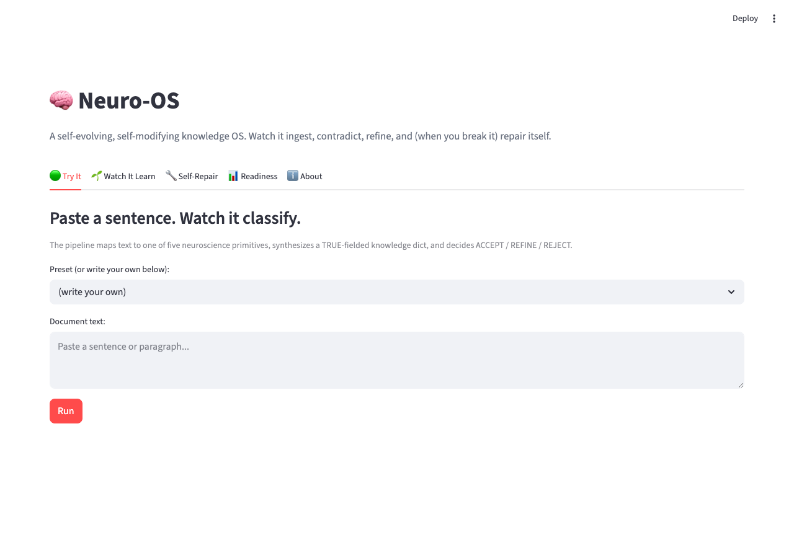
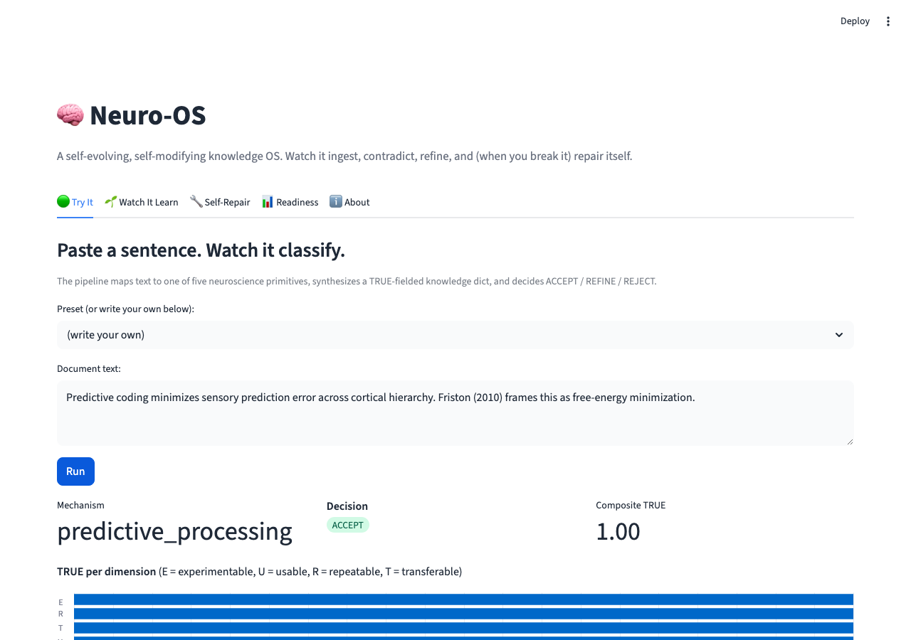
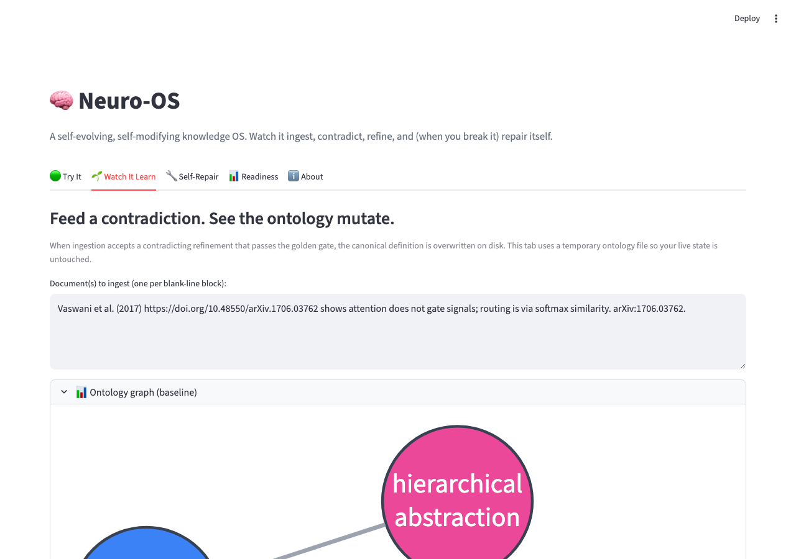
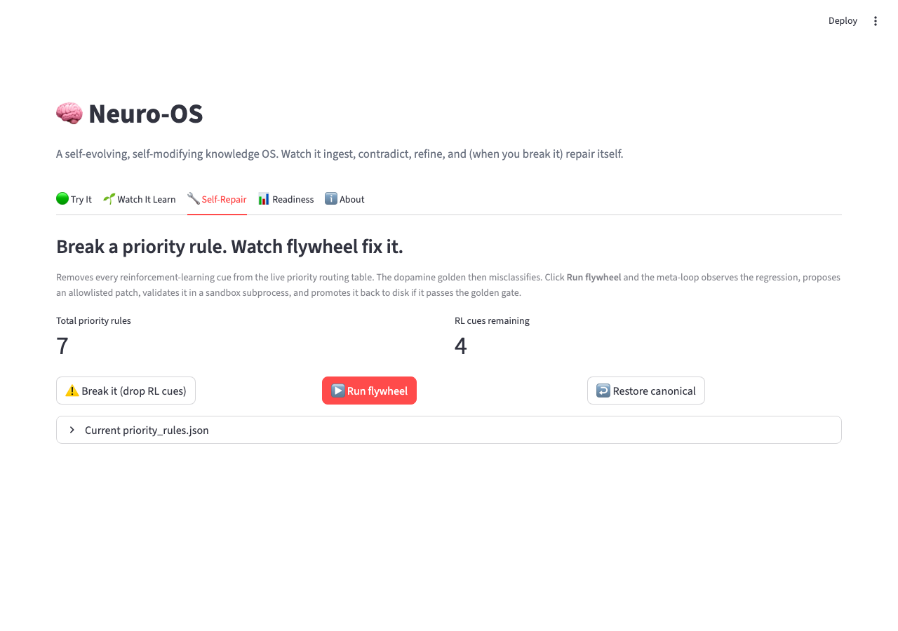
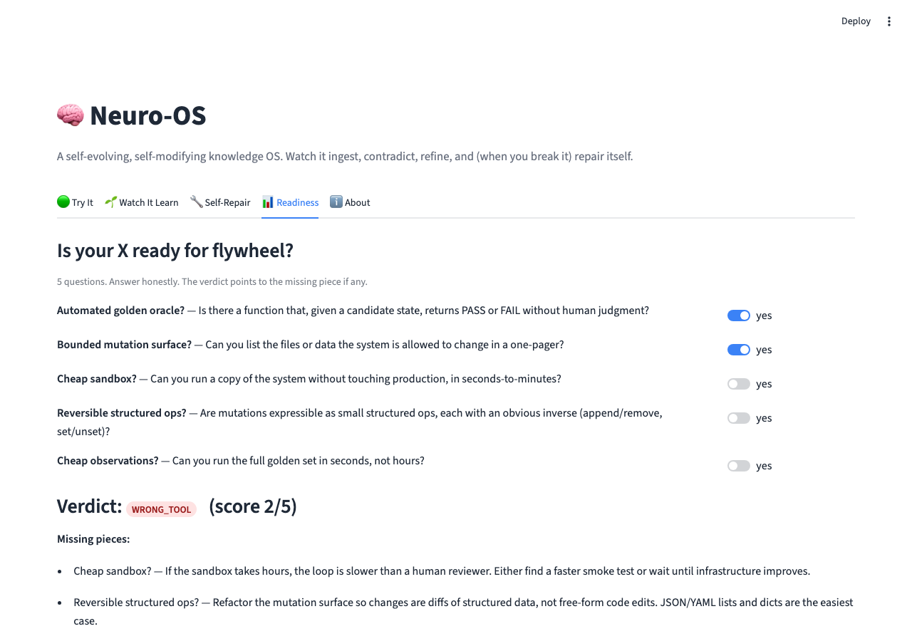

# Neuro-OS UI

A Streamlit app that makes neuro-os legible in 60 seconds.

## Run locally

```bash
pip install -e ".[ui]"
streamlit run ui/app.py
```

The app opens at http://localhost:8501.

## Tabs

Each tab below is a distinct lens on neuro-os; you can switch between them at any time. Click a screenshot to see the full size.

### 🟢 Try It — paste a sentence, watch it classified

[](assets/01_try_it.png)

Paste any sentence. The pipeline classifies it: returns the inferred mechanism, the routing decision (`ACCEPT` / `REFINE` / `REJECT`), per-dimension TRUE scores, and an evidence-strength rollup.

[](assets/02_try_it_result.png)

The result shows the verdict the daemon would have produced if you POSTed the same text to `/extract`. Useful for prompt-shape exploration without round-tripping through the CLI.

### 🌱 Watch It Learn — feed a contradiction, see the ontology shift

[](assets/03_watch_learn.png)

Feed a citation-rich contradiction. The tab renders a side-by-side ontology graph (baseline vs. after) — green-bordered nodes show primitives that *accreted citations* during the L1 self-evolving loop. This is the closest thing to seeing the system "learn" at conversation speed.

### 🔧 Self-Repair — break it, watch it heal itself

[](assets/04_self_repair.png)

A bipartite routing graph. Click **Break it** → 4 RL edges turn dashed gray. Click **Run flywheel** → 1 edge turns bright green when L2 self-modification promotes a patch through the golden-case gate. Live, deterministic, no LLM. Animated version: [`assets/self_repair.gif`](assets/self_repair.gif).

### 📊 Readiness — does my X have what neuro-os needs?

[](assets/05_readiness.png)

Toggle 5 questions about your own X (Y our problem domain). Live verdict — `READY` / `INVEST_TO_BE_READY` / `WRONG_TOOL` — plus advice on the missing piece. Useful before you commit a weekend to wiring neuro-os into a new vertical.

### ℹ️ About — links + CLI cheatsheet

Static info tab: links to the source repos, the CLI cheatsheet, and the relevant docs in `docs/`.

| Tab | What it does | What you'll see |
|---|---|---|
| **🟢 Try It** | Paste a sentence; the pipeline classifies it. | Mechanism, decision (ACCEPT / REFINE / REJECT), TRUE per dimension, evidence strength. |
| **🌱 Watch It Learn** | Feed a citation-rich contradiction. | Side-by-side ontology graph (baseline vs after) with green-bordered nodes for primitives that accreted citations. |
| **🔧 Self-Repair** | Click "Break it" then "Run flywheel". | A bipartite routing graph mutates live: 4 RL edges turn dashed gray when broken, 1 turns bright green when flywheel promotes a patch. See [`assets/self_repair.gif`](assets/self_repair.gif). |
| **📊 Readiness** | Toggle the 5 questions for your own X. | Live verdict (READY / INVEST_TO_BE_READY / WRONG_TOOL) + advice on the missing piece. |
| **ℹ️ About** | Links to repos + CLI cheatsheet. | |

## How this fits with the rest of neuro-os

The Streamlit app is **one of three UI surfaces** for neuro-os. The other two are:

- **[Browser extension](browser_extension/README.md)** — Manifest V3 extension for Chrome/Firefox. Founder-loop only. Renders the Tank widget (badge + new-tab) and the Sublimation Card overlay on 8 distraction hosts.
- **[System tray app](tray_app/README.md)** — Cross-platform (Linux / macOS / Windows). Polls the daemon every 60s and renders the tank gauge in your menu bar.

Plus the **CLI** (`neuro-os ...`) — see [`docs/how-to-use-it.md`](../docs/how-to-use-it.md) for the full daily-flow tour. The four verticals (founder_loop / research / investment / startup) all expose CLI today; chat surfaces ship for founder_loop only in v0.

## Deploy to Streamlit Cloud (free)

The repo already ships with everything Streamlit Cloud needs:

- `streamlit_app.py` (entry point at repo root)
- `requirements.txt` (declares `flywheel-loop` from git + `streamlit`)
- `runtime.txt` (Python 3.11)
- `.streamlit/config.toml` (theme + non-headless server)

To deploy:

1. Sign in at https://share.streamlit.io with your GitHub account.
2. Click **New app**.
3. Repository: `wjlgatech/neuro-os`. Branch: `main`. Main file path: `streamlit_app.py`.
4. (Optional) Set a custom subdomain like `neuro-os.streamlit.app`.
5. Click **Deploy**. First boot takes ~2 minutes (it pip-installs `flywheel-loop` from git + streamlit + their deps).

The app is now live at `https://<your-subdomain>.streamlit.app`. Each push to `main` redeploys automatically.

### Notes for deployment

- The Self-Repair tab on Streamlit Cloud will mutate `agent/data/priority_rules.json` in the *deployed container*, not in any persistent storage. Each app restart reverts to canonical state. That's fine for a demo.
- The hosted app shares one process across users. Heavy concurrent self-repair runs can collide. For real multi-user use, the meta-loop should write to a per-session sandbox (out of scope for v0.1 of the UI).

## Safety

- The Self-Repair tab is the only path that writes to the live tree, and only to `agent/data/priority_rules.json`.
- A session snapshot is taken on first load so "Restore canonical" always returns to baseline.
- All other tabs use `tempfile.mkdtemp` to keep the live registry / feedback log clean.

## Updating screenshots / GIF

```bash
streamlit run ui/app.py --server.port 8765 --server.headless true &
python3 ui/scripts/screenshot_tabs.py     # static screenshots
python3 ui/scripts/record_gif.py          # animated self-repair GIF
```

The recording scripts use playwright + imageio. Install with:

```bash
pip install playwright imageio
playwright install chromium-headless-shell
```
